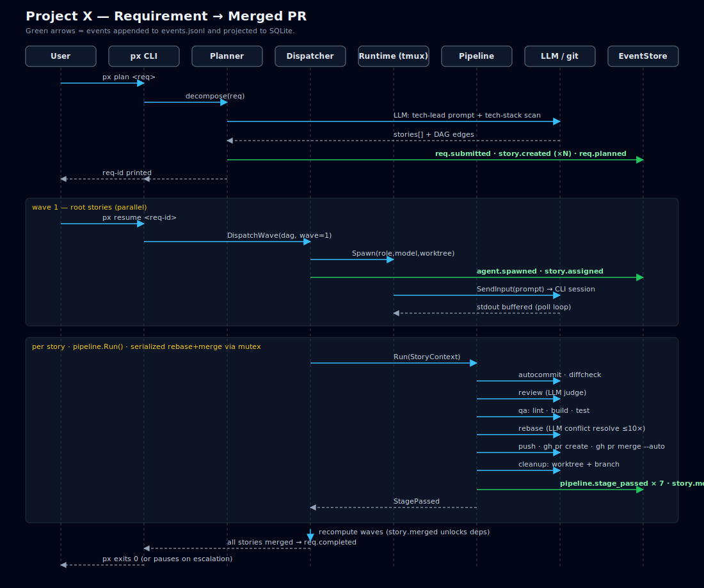
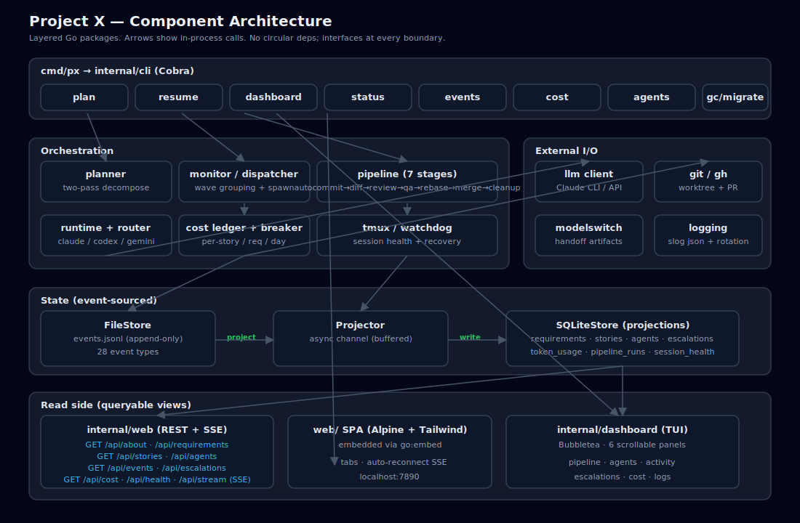

# Project X (`px`)

**Autonomous AI agent orchestration for the full software development lifecycle.**

Hand off a requirement. Walk away. Come back to merged PRs.

`px` decomposes natural-language requirements into atomic stories, dispatches AI coding agents across parallel waves, and drives each story through code review, QA, rebase with LLM-powered conflict resolution, and auto-merge — all while enforcing cost budgets and monitoring session health.

<p align="center">
  
</p>

## Demo

The README embeds the checked-in `demo.gif`, generated from [`demo.tape`](demo.tape). The current tape shows the Claude-first planning fallback flow, reviews the generated plan, resumes execution on Codex-backed implementation agents, opens the TUI dashboard while work is in flight, and then launches `px dashboard --web`. The render uses the committed [`demo.config.yaml`](demo.config.yaml) to keep planning Claude-first while routing execution roles to Codex for a stable live demo.

Because VHS only records the terminal, the browser-based dashboard is shown separately below from a real `px dashboard --web` run against the same isolated demo config.

<p align="center">
  
</p>

To regenerate the animation, install [VHS](https://github.com/charmbracelet/vhs) and run:

```bash
brew install vhs
vhs demo.tape
```

If the scripted flow changes, update [`demo.tape`](demo.tape) first and then re-render `demo.gif` so the README stays accurate.

---

## Why `px`?

Most AI coding tools are single-agent, single-task. You prompt, it generates, you review. For anything beyond a single file, you're back to doing the integration work yourself.

`px` is different. It runs the **entire pipeline autonomously**:

1. A **Tech Lead AI** decomposes your requirement into atomic stories with dependency ordering
2. A **Dispatcher** assigns stories to agent roles (Junior, Intermediate, Senior) based on complexity
3. **Agents work in parallel** across isolated git worktrees, using the AI CLI of your choice
4. A **Pipeline** drives each completed story through review, QA, rebase, and merge
5. A **Watchdog** detects stuck sessions, permission prompts, and dead processes
6. A **Cost Breaker** enforces budgets so you never get surprised by a bill

The result: you describe what you want, and `px` produces merged PRs.

---

## Features

| Feature | Description |
|---------|-------------|
| **Multi-Agent Orchestration** | Parallel waves of agents with DAG-based dependency resolution |
| **Cost Protection** | Per-story, per-requirement, and daily budget limits with circuit breakers |
| **Multi-Runtime** | Pluggable support for Claude Code, Codex, and Gemini CLIs |
| **Two-Pass Planning** | LLM decomposes requirements, then validates story quality before dispatch |
| **7-Stage Pipeline** | Auto-commit, diff check, code review, QA, rebase with conflict resolution, merge, cleanup |
| **LLM Conflict Resolution** | Rebase conflicts resolved automatically via LLM (up to 10 rounds) |
| **Session Health** | Detects stale, dead, and missing tmux sessions with configurable recovery |
| **TUI Dashboard** | 6 scrollable panels: pipeline, agents, activity, escalations, cost, logs |
| **Web Dashboard** | Browser-based dashboard with REST API and real-time Server-Sent Events |
| **Event-Sourced State** | Append-only JSONL event log + SQLite projections — full auditability |
| **Smart Routing** | Cost-aware runtime selection with preference chains and fallback |
| **Watchdog** | Auto-bypasses permission prompts, escapes plan mode, detects stuck agents |

---

## Quick Start

### Prerequisites

| Tool | Purpose | Install |
|------|---------|---------|
| **Go 1.22+** | Build `px` | [go.dev/dl](https://go.dev/dl/) |
| **tmux** | Agent session management | `brew install tmux` / `apt install tmux` |
| **git** | Version control | Pre-installed on most systems |
| **gh** | GitHub CLI (PR creation) | `brew install gh` / [cli.github.com](https://cli.github.com) |
| **claude** | Claude Code CLI (primary runtime) | [claude.ai/download](https://claude.ai/download) |

Optional runtimes: `codex` (OpenAI), `gemini` (Google).

> **Model choice for the current codebase:** start with Claude Code first. Planning, review, and rebase-conflict resolution currently go through the Claude CLI client, so Claude Sonnet/Opus is the path that is wired end-to-end today. Use `codex` only after you also switch the routed role's `models.<role>.provider` and `model` to OpenAI-compatible values.
>
> If you enable the `fallback` section in `px.yaml`, `px` can stay Claude-first but ask for approval before switching exhausted Claude work over to OpenAI. Planner/review/rebase calls first try the OpenAI API and can then ask again to continue on local `codex` if the API quota is exhausted, while in-progress coding stories can hand off to the configured runtime in the same worktree with generated `PX_HANDOFF.md`, `PX_HANDOFF.json`, and `PX_TRANSCRIPT_SNAPSHOT.log` artifacts.

Use this fallback block in your `px.yaml` or `px.config.yaml`:

```yaml
fallback:
  enabled: true
  require_approval: true
  llm_model: gpt-5.4
  runtime: codex
  runtime_model: gpt-5.4
  handoff_output_lines: 80
```

The repo also includes the same settings in [`px.config.example.yaml`](px.config.example.yaml), and the live demo uses them from [`demo.config.yaml`](demo.config.yaml).

### Install

```bash
# From source (recommended)
git clone https://github.com/tzone85/project-x.git
cd project-x
make build
sudo mv px /usr/local/bin/

# Or via go install
go install github.com/tzone85/project-x/cmd/px@latest
```

### First Run

```bash
# 1. Initialize the database and state directory
px migrate

# 2. (Optional) Create a config file for custom settings
cp px.config.example.yaml px.yaml

# 3. Plan a requirement
echo "Build a REST API for task management with CRUD endpoints" | px plan -

# 4. Review the generated plan
px plan --review <req-id>    # use the ID from step 3

# 5. Dispatch agents and watch them work
px resume <req-id>

# 6. Monitor progress
px dashboard                 # TUI (default)
px dashboard --web           # Browser at http://localhost:7890
```

---

## How It Works

The full requirement-to-merged-PR sequence is rendered below. For the
deep-dive (component diagram, state model, extension points), see
[docs/superpowers/specs/2026-05-22-architecture-reference.md](docs/superpowers/specs/2026-05-22-architecture-reference.md).

<p align="center">
  
</p>

### Wave Execution

Stories are grouped into **waves** by topological sort of the dependency DAG:

- **Wave 1**: Stories with no dependencies (root nodes) — run in parallel
- **Wave 2**: Stories depending only on Wave 1 — dispatched after Wave 1 merges
- **Wave N**: Continues until all stories are merged

Each agent runs in an isolated **git worktree** with its own branch. The merge pipeline serializes rebase-push-merge via a mutex, so each story rebases onto the latest `main` including all prior merges.

### Agent Roles

| Role | Complexity | Typical Model | Use Case |
|------|-----------|---------------|----------|
| **Junior** | 1-3 | gpt-4o-mini / Haiku | Simple, well-defined tasks |
| **Intermediate** | 4-5 | Sonnet | Moderate complexity |
| **Senior** | 6-13 | Opus / Sonnet | Complex, architectural work |
| **Tech Lead** | — | Opus | Requirement decomposition |
| **QA** | — | Sonnet | Lint, build, test verification |
| **Supervisor** | — | Sonnet | Drift detection (future) |

Roles are assigned automatically based on the story's Fibonacci complexity score.

---

## CLI Reference

| Command | Description |
|---------|-------------|
| `px plan <file>` | Decompose a requirement into stories |
| `px plan --review <id>` | Inspect a planned requirement's stories |
| `px plan --refine <id>` | Re-plan with feedback from stdin |
| `px resume <id>` | Dispatch agents and monitor pipeline |
| `px resume <id> --godmode` | Autonomous mode (skip permission prompts) |
| `px dashboard` | Launch TUI dashboard |
| `px dashboard --web` | Launch browser dashboard |
| `px dashboard --web --port 8080` | Custom port |
| `px status` | Show all requirements and story counts |
| `px status <id>` | Show detailed status for one requirement |
| `px events` | Show recent events |
| `px events --limit 50` | Show last 50 events |
| `px cost` | Show cost breakdown with budget bars |
| `px cost <id>` | Show cost for a specific requirement |
| `px agents` | List all agents and their status |
| `px config show` | Display current configuration |
| `px config validate` | Validate configuration |
| `px archive <id>` | Archive a completed requirement |
| `px gc` | Garbage collect old worktrees and branches |
| `px migrate` | Run database migrations |

---

## Configuration

Copy the example and customize:

```bash
cp px.config.example.yaml px.yaml
```

### Key Settings

```yaml
# Budget protection (the most important config)
budget:
  max_cost_per_story_usd: 2.00
  max_cost_per_requirement_usd: 20.00
  max_cost_per_day_usd: 50.00
  warning_threshold_pct: 80
  hard_stop: true

# Runtime routing preferences
routing:
  junior_max_complexity: 3
  intermediate_max_complexity: 5
  preferences:
    - role: junior
      prefer: codex
      fallback: claude-code
    - role: senior
      prefer: claude-code
      fallback: gemini

# Pipeline retry policies
pipeline:
  stages:
    review:
      max_retries: 2
      on_exhaust: escalate
    qa:
      max_retries: 3
      on_exhaust: pause_requirement
    rebase:
      max_retries: 2
      on_exhaust: pause_requirement

# Session health monitoring
sessions:
  stale_threshold_s: 180
  on_dead: redispatch
  on_stale: restart
  max_recovery_attempts: 2
```

See [`px.config.example.yaml`](px.config.example.yaml) for all options with inline documentation.

---

## Architecture

<p align="center">
  
</p>

```
project-x/
├── cmd/px/              # CLI entry point
├── internal/
│   ├── agent/           # Agent roles, prompts, complexity routing
│   ├── cli/             # Cobra command implementations
│   ├── config/          # YAML config types, loading, validation
│   ├── cost/            # Ledger, circuit breaker, pricing table
│   ├── dashboard/       # Bubbletea TUI (6 scrollable panels)
│   ├── git/             # Git ops, worktree, GitHub PR, tech stack scan
│   ├── graph/           # DAG, topological sort, wave grouping
│   ├── llm/             # Client interface + Claude CLI, Anthropic, OpenAI
│   ├── monitor/         # Dispatcher, executor, poller, watchdog
│   ├── pipeline/        # 7 composable stages (review -> merge)
│   ├── planner/         # Two-pass requirement decomposition
│   ├── runtime/         # Pluggable AI CLI runtimes + smart router
│   ├── state/           # Event store (JSONL), projections (SQLite)
│   ├── tmux/            # Session management, health monitoring
│   └── web/             # REST API + SSE + embedded SPA
├── docs/
│   ├── diagrams/        # Rendered SVGs (architecture, sequence)
│   └── superpowers/specs/  # Architecture + onboarding deep-dives
├── migrations/          # SQLite schema migrations (embedded)
├── web/                 # Browser dashboard (Alpine.js + Tailwind)
└── test/e2e/            # End-to-end integration tests
```

For a guided onboarding (clone → first PR), see
[docs/superpowers/specs/2026-05-22-onboarding.md](docs/superpowers/specs/2026-05-22-onboarding.md).

### Package Dependency Flow

```
cli -> monitor -> pipeline -> {runtime, llm, state, cost, git}
   \-> planner -> {llm, state, graph, git}
   \-> dashboard -> state
   \-> web -> state
```

No circular dependencies. Interfaces at every package boundary.

### State Model

`px` uses **event sourcing**: every state change is recorded as an immutable event in an append-only JSONL file. SQLite materialized views (projections) provide fast queries. If the SQLite database is lost, it can be rebuilt by replaying the event log.

```
Events (source of truth)     Projections (queryable views)
┌──────────────────┐         ┌──────────────────┐
│ events.jsonl     │ ──────> │ px.db (SQLite)   │
│ (append-only)    │  async  │ - requirements   │
│                  │  channel│ - stories        │
│ REQ_SUBMITTED    │         │ - agents         │
│ STORY_CREATED    │         │ - escalations    │
│ STORY_ASSIGNED   │         │ - token_usage    │
│ STORY_COMPLETED  │         │ - pipeline_runs  │
│ STORY_MERGED     │         │ - session_health │
│ BUDGET_WARNING   │         └──────────────────┘
│ ...28 event types│
└──────────────────┘
```

---

## Cost Protection

Cost protection was the #1 design priority for `px`. Three layers of defense:

1. **Ledger** — Records every token spent, by story, requirement, and day
2. **Circuit Breaker** — Checks budgets *before* each LLM call, blocks if over limit
3. **CLI Visibility** — `px cost` shows real-time spending with budget bars

```
$ px cost
Daily Cost (2026-03-20)
  [ok] [########............] $12.40 / $50.00

Requirement: 01KM5QT1... (Add user auth)
  [! ] [##############......] $16.20 / $20.00
  Stories:
    01KM5Q-s-1  Setup DB schema     $2.10
    01KM5Q-s-2  User model          $4.30
    01KM5Q-s-3  Auth endpoints      $9.80
```

By default, `px` routes all LLM calls through the **Claude CLI** (subscription-based, no per-token cost). Direct API calls are opt-in only via `PX_USE_API=true`.

---

## Dashboards

### TUI Dashboard

```bash
px dashboard
```

6 scrollable panels with keyboard navigation:

| Key | Action |
|-----|--------|
| `1`-`6` | Switch panel |
| `Tab` | Next panel |
| `j`/`k` | Scroll up/down |
| `g`/`G` | Jump to top/bottom |
| `PgUp`/`PgDn` | Page scroll |
| `q` | Quit |

Panels: Pipeline (kanban), Agents (table), Activity (event log), Escalations, Cost (budget bars), Logs.

### Web Dashboard

```bash
px dashboard --web              # http://localhost:7890
px dashboard --web --port 8080  # custom port
```

Real-time browser dashboard with kanban pipeline view, agent table, event stream (via SSE), cost breakdown, and auto-reconnect. Zero dependencies — ships embedded in the Go binary.

---

## Adding a New Runtime

`px` supports any AI coding CLI through the `Runtime` interface:

```go
type Runtime interface {
    Name() string
    Spawn(runner CommandRunner, cfg SessionConfig) error
    Kill(runner CommandRunner, sessionName string) error
    DetectStatus(runner CommandRunner, sessionName string) (AgentStatus, error)
    ReadOutput(runner CommandRunner, sessionName string, lines int) (string, error)
    SendInput(runner CommandRunner, sessionName string, input string) error
    Capabilities() RuntimeCapabilities
}
```

Built-in runtimes: `ClaudeCodeRuntime`, `CodexRuntime`, `GeminiRuntime`. To add a new one, implement the interface and register it in the runtime registry.

---

## Development

```bash
# Clone
git clone https://github.com/tzone85/project-x.git
cd project-x

# Build
make build

# Test (requires CGO for SQLite)
make test

# Lint
make lint

# All at once
make lint && make test && make build
```

See [CONTRIBUTING.md](CONTRIBUTING.md) for code style, PR process, and architecture details.

---

## Roadmap

- [ ] VHS demo tape for automated GIF generation
- [ ] Pure-Go SQLite driver (`modernc.org/sqlite`) to eliminate CGO requirement
- [ ] Cross-platform binary releases via GoReleaser
- [ ] Homebrew tap (`brew install tzone85/tap/px`)
- [ ] Multi-repo support (orchestrate across multiple repositories)
- [ ] Webhook notifications (Slack, Discord, email)
- [ ] Agent reputation scoring and adaptive routing
- [ ] Supervisor agent for drift detection and reprioritization

---

## License

[Apache 2.0](LICENSE)

---

Built with Go, Bubbletea, Alpine.js, and a healthy respect for API budgets.
