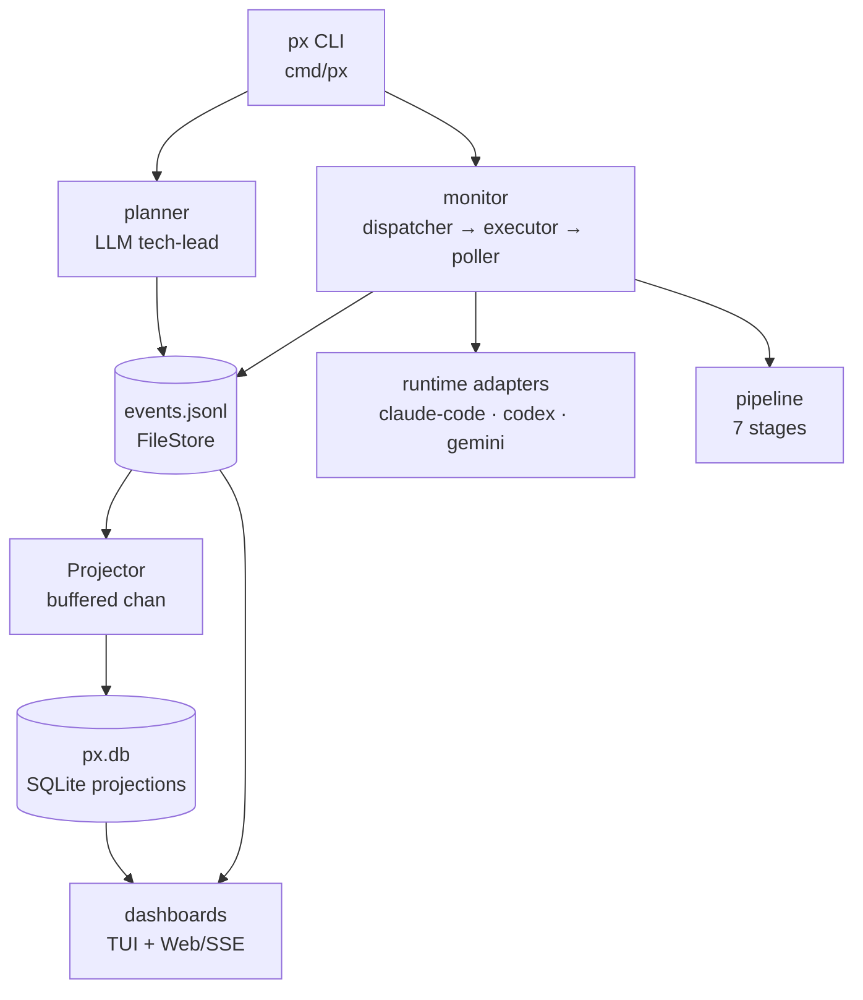

# Architecture at a glance

## The path of a single requirement

1. **`px plan requirement.txt`** — tech-lead decomposes into atomic stories with a DAG.
2. **`px resume <req-id> --godmode`** — monitor builds DAG, groups into waves, dispatches.
3. **Per story:** isolated git worktree at `~/.px/worktrees/<story-id>`; tmux session; runtime adapter runs the AI CLI.
4. **Handoff:** spawn script touches `.px-done` after CLI exits — poller triggers pipeline.
5. **Pipeline:** autocommit → diffcheck → review (LLM + [[04-Pipeline-stages-walkthrough|spec-vs-output gate]]) → qa → rebase (with [[05-Conflict-resolution-and-rebase-guard|conflict resolver]]) → merge → cleanup.
6. **Completion:** all stories merge → `autoCleanupAfterCompletion` runs → workspace is empty.

## Event sourcing in two paragraphs

Every state mutation goes through `state.NewEvent(...)` → append to
`events.jsonl` → publish to the projector → projector writes the materialized
row in `px.db`. **No code paths bypass this.** The projection is rebuildable.

That gives you three properties for free:
- **Recoverable** — replay JSONL to rebuild `px.db`.
- **Auditable** — full history is preserved.
- **Concurrency-safe** — projections are written by a single goroutine on a
  256-buffered channel; back-pressure blocks the publisher rather than
  dropping events.

## Where to start reading code

- Entry: `cmd/px/main.go` → `internal/cli/root.go::NewRootCmd`.
- Plan: `internal/cli/plan.go::runPlan` → `internal/planner/planner.go::Plan`.
- Resume: `internal/cli/resume.go::runResume` → `runWaveLoop`.
- Pipeline composition: `internal/cli/resume.go` builds the slice.
- Health & dispatch: `internal/monitor/poller.go::pollOnce` is the run-loop heart.
