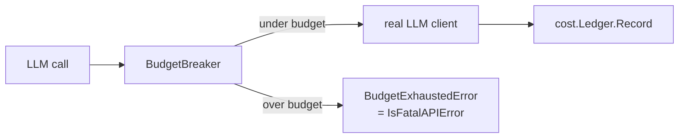

# Cost protection and budget breakers

px-dispatch spends money on every LLM call. The cost protection layer makes
that bounded.

## Three layers



- **`cost.Ledger`** — append-only token-usage table in `px.db`.
- **`cost.BudgetBreaker`** — circuit breaker. Checks budgets BEFORE each
  call. On exhaust returns `BudgetExhaustedError` → classified by
  `llm.IsFatalAPIError` → pipeline pauses cleanly.
- **CLI visibility** — `px cost`, `px cost <req-id>`, dashboard cost panel.

## Budgets

```yaml
budget:
  max_cost_per_day_usd: 10.0           # rolls over at local midnight
  max_cost_per_requirement_usd: 5.0
  max_cost_per_story_usd: 2.0
  hard_stop: true
```

The day boundary is **local time**, not UTC. We learned this when token
inserts went in just before UTC midnight (still "today" in SAST) and the
"today total" query ran in UTC the next morning. Fixed by
`date(created_at, 'localtime') = ?` in the query.

## How a breaker decides

```go
breaker := cost.NewBudgetBreaker(ledger, cfg.Budget)
resp, err := breaker.Complete(ctx, req)
// 1. ledger.QueryByDay(today)
// 2. ledger.QueryByRequirement(reqID)
// 3. ledger.QueryByStory(storyID)
// 4. call wrapped client
// 5. ledger.Record(usage)
```

`hard_stop: false` logs a warning event but lets the call through. Default
is `true`.

## What's NOT measured

- Compute (tmux/disk/CI).
- Subscription Claude calls — the ledger records the call but cost is
  `0.00`. Budget caps are about *API spend*, not subscription effort.

## Reading data

```bash
px cost                                      # today + per-req summary
px cost 01ABC…                               # per-story breakdown
curl localhost:7890/api/cost?req_id=01ABC…   # same over HTTP
```
